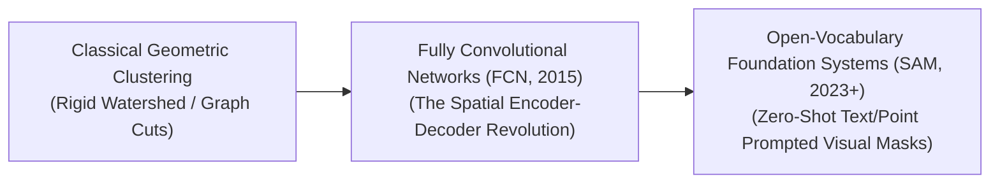

# 🎨 Awesome-Semantic-Segmentation

  

  

> **Awesome Semantic Segmentation** is a curated list of semantic segmentation techniques, architectures, and resources. Optimize your computer vision research with deep learning, encoder-decoder networks, and foundation models.

---

## 📌 Table of Contents
1. [🧠 Semantic Segmentation in AI: Evolution, Variants, Types, & Applications](#-semantic-segmentation-in-ai-evolution-variants-types--applications)
2. [📅 1. The Chronological Evolution](#-1-the-chronological-evolution)
3. [⚙️ 2. Core Functional & Architectural Variants](#️-2-core-functional--architectural-variants)
4. [🏗️ 3. High-Capacity Architectural Component Types](#️-3-high-capacity-architectural-component-types)
5. [🛠️ 4. Production Engineering Challenges & Hardware Solutions](#️-4-production-engineering-challenges--hardware-solutions)
6. [🚀 5. Frontier Real-World AI Applications](#-5-frontier-real-world-ai-applications)

---

## 🧠 Semantic Segmentation in AI: Evolution, Variants, Types, & Applications

Semantic Segmentation is a dense computer vision paradigm where a model assigns a specific categorical label to every single pixel coordinate in an image. Unlike image classification (which predicts a global label for an entire canvas) or object detection (which draws coarse 2D bounding boxes), semantic segmentation provides fine-grained, pixel-level scene understanding. It groups pixels belonging to the same semantic class (e.g., `road`, `pedestrian`, `sky`) into absolute structural shapes. Over the history of AI, this field has transitioned from manual boundary-clustering heuristics to deep deep-learning architectures, multi-scale skip networks, and open-vocabulary foundational foundation models.

---

## 📅 1. The Chronological Evolution

The technical progression of pixel-level classification has transitioned from hand-crafted edge clustering to encoder-decoder skip networks and unified, open-vocabulary attention topologies.

| Era & Concept | Details | Year First Used | Paper Link |
| :--- | :--- | :--- | :--- |
| [**The Heuristic Boundary & Graph Cut Era (Classical Vision, Pre-2015)**](details/heuristic_boundary_graph_cuts.md) | *Concept:* The structural baseline. Early frameworks relied entirely on low-level mathematical pixel variations—such as tracking sudden changes in color histograms, edge gradients, and textures. Algorithms like **Watershed Segmentation**, Mean-Shift, and normalized graph cuts manually partitioned images into spatial zones.  *Limitation:* Lacked deep semantic context. The system split regions based on absolute visual contrast but could not understand *what* the objects were, collapsing when encountering variable shadows or complex textures. | 2001 | [Interactive Graph Cuts](https://ieeexplore.ieee.org/document/937505) |
| [**The Fully Convolutional & Encoder-Decoder Era (FCN / U-Net / DeepLab, ~2015–2022)**](details/fully_convolutional_networks.md) | *Concept:* Sparked by Long et al.'s **Fully Convolutional Networks (FCN)**. It replaced the rigid, flat classification heads of standard CNNs with convolutional upsampling blocks [INDEX: 1]. This evolved into **U-Net (2015)**, which introduced symmetrical lateral skip connections to route high-resolution spatial boundaries straight across the network graph [INDEX: 1]. Concurrently, Google's **DeepLab** series introduced **Atrous (Dilated) Convolutions** to expand receptive fields without losing parameter density [INDEX: 1].  *Significance:* Successfully mapped deep network capabilities directly to dense pixel-level outputs, standardizing automated medical and industrial imaging. | 2015 | [Fully Convolutional Networks](https://arxiv.org/abs/1411.4038) |
| [**The Foundation & Open-Vocabulary Era (~2023–Present)**](details/segment_anything_model.md) | *Concept:* The current modern state-of-the-art standard. Popularized by Meta's **Segment Anything Model (SAM)** and open-vocabulary architectures like **Grounded-SAM**. It discards static class counts, reframing segmentation as an interactive, promptable foundation task.  *Significance:* Models are trained on billions of diverse masks using self-supervised objectives. Users can segment completely novel, un-indexed objects on-the-fly using geometric prompts (points, bounding boxes) or arbitrary natural language descriptions at inference time. | 2023 | [Segment Anything](https://arxiv.org/abs/2304.02643) |

---

## ⚙️ 2. Core Functional & Architectural Variants

Semantic Segmentation setups are categorized based on how they track bounding contours, manage multi-scale features, and differentiate intersecting objects.

| Variant | Mechanism | Year First Used | Paper Link |
| :--- | :--- | :--- | :--- |
| [**Standard Semantic Segmentation**](details/standard_semantic_segmentation.md) | Maps classification probabilities directly to every pixel coordinate. If multiple distinct objects of the same class overlap (e.g., three separate cars parked in a row), they are all shaded with the exact same color, treating them as a single collective class mass. | 2015 | [Fully Convolutional Networks](https://arxiv.org/abs/1411.4038) |
| [**Instance Segmentation**](details/instance_segmentation.md) | Combines object detection with dense masking. It detects individual object instances first and isolates their respective contours independently. Overlapping cars receive unique tracking identifiers and separate colored masks (e.g., `Car #1`, `Car #2`). | 2014 | [Simultaneous Detection and Segmentation](https://arxiv.org/abs/1407.1808) |
| [**Panoptic Segmentation**](details/panoptic_segmentation.md) | The holistic spatial integration standard. It unifies Semantic and Instance segmentation into a single output graph. It tracks **"Things"** (countable individual objects like people, bicycles, or cars) alongside **"Stuff"** (amorphous, continuous background regions like grass, sky, or roads). | 2019 | [Panoptic Segmentation](https://arxiv.org/abs/1801.00868) |
| [**Open-Vocabulary Segmentation (OVS)**](details/open_vocabulary_segmentation.md) | Leverages a shared vision-language latent space (such as CLIP alignments). Instead of matching pixels to a fixed class index, the network projects text prompt embeddings dynamically, allowing users to write highly descriptive labels (e.g., `"vintage ceramic teapot"`) to extract exact pixel boundaries. | 2022 | [Language-driven Semantic Segmentation](https://arxiv.org/abs/2201.03546) |

---

## 🏗️ 3. High-Capacity Architectural Component Types

To retain crisp spatial definitions through deep neural layers, segmentation networks deploy specialized convolutional and routing layers.

| Component Type | Profile | Year First Used | Paper Link |
| :--- | :--- | :--- | :--- |
| [**Lateral Skip Connections (U-Net Topology)**](details/lateral_skip_connections.md) | Symmetrical data bridges [INDEX: 1]. As an image passes through downsampling layers, fine-grained structural border details are typically blurred. Skip connections copy high-resolution spatial boundaries from early encoder layers and fuse them straight into the matching decoder layers [INDEX: 1], ensuring crisp edge reconstructions. | 2015 | [U-Net](https://arxiv.org/abs/1505.04597) |
| [**Atrous / Dilated Convolutional Kernels**](details/dilated_convolutions.md) | Spaced-out sampling filters [INDEX: 1]. Injects regular mathematical gaps into the kernel matrix. This allows a layer to dramatically expand its **effective receptive field** (viewing vast context spans) without adding extra parameters or requiring aggressive downsampling pooling steps [INDEX: 1]. | 2015 | [Multi-Scale Context Aggregation](https://arxiv.org/abs/1511.07122) |
| [**Atrous Spatial Pyramid Pooling (ASPP)**](details/atrous_spatial_pyramid_pooling.md) | Multi-scale capture blocks. Passes an intermediate feature map through multiple parallel dilated convolutional layers featuring different sampling frequencies simultaneously, capturing features at multiple scales concurrently. | 2016 | [DeepLab v2](https://arxiv.org/abs/1606.00915) |

---

## 🛠️ 4. Production Engineering Challenges & Hardware Solutions

Deploying dense pixel-level models within real-world engineering constraints requires balancing activation bloat with processing speeds.

| Challenge & Solution | Details | Year First Used | Paper Link |
| :--- | :--- | :--- | :--- |
| [**The Activation Memory Explosion Wall**](details/activation_memory_checkpointing.md) | *The Problem:* Evaluating classification scores across every individual pixel coordinate in a high-resolution image creates massive, multi-gigabyte activation maps inside hidden layers. This rapidly chokes hardware VRAM during training loops, causing frequent Out-of-Memory crashes.  *Mitigation:* Implementing **Selective Activation Checkpointing** (discarding non-boundary activation maps after forward execution and rematerializing them on-the-fly during backpropagation) or shifting to **Linear-Attention Vision Transformers**. | 2016 | [Training Deep Nets with Sublinear Memory Cost](https://arxiv.org/abs/1604.06174) |
| [**The Computational Inference Latency Bottleneck**](details/tvm_hardware_compilation.md) | *The Problem:* Safety-critical applications (such as an autonomous vehicle correcting for a lane drift) require segmentation pipelines running at speeds exceeding $30\text{ Hz}$ to $60\text{ Hz}$. Traditional deep encoder-decoder graphs introduce heavy multi-pass latency.  *Mitigation:* Compiling networks into highly optimized **Fused Hardware Kernels** (using tools like TensorRT or Apache TVM) that collapse the spatial convolution, normalization, and activation steps straight into GPU SRAM registers. | 2018 | [TVM Compiler](https://arxiv.org/abs/1802.04799) |

---

## 🚀 5. Frontier Real-World AI Applications

| Application | Details | Year First Used | Paper Link |
| :--- | :--- | :--- | :--- |
| [**Autonomous Vehicle Perception & Navigation Stacks**](details/autonomous_vehicle_perception.md) | Processes real-time streaming video frames, radar signatures, and lidar grids concurrently. Embedded semantic and panoptic segmentation networks map free drivable spaces, identify lane lines, and isolate pedestrian contours, letting the vehicle's routing engine calculate path trajectories safely. | 2016 | [Cityscapes Dataset](https://arxiv.org/abs/1604.01685) |
| [**High-Resolution Clinical Diagnostic Tissue Mapping**](details/clinical_tissue_mapping.md) | Analyzes multi-megapixel medical scans (such as MRIs, CT volumes, and digital pathology slides). Symmetrical encoder-decoder networks (U-Net variants) automate pixel-level tracking for tumor borders, organ anomalies, and structural fractures, providing radiologists with precise volumetric measurements for surgery planning [INDEX: 1]. | 2015 | [U-Net](https://arxiv.org/abs/1505.04597) |
| [**Satellite Remote Sensing & Agricultural Zoning**](details/satellite_remote_sensing.md) | Processes planetary imagery and hyperspectral mapping data. Open-vocabulary and dense segmentation models parse earth observation feeds automatically, delineating crop health clusters, tracking deforestation boundaries, and monitoring urban expansion zones across changing seasonal cycles. | 2010 | [Detecting Roads in Aerial Images](https://doi.org/10.1007/978-3-642-15567-3_16) |

