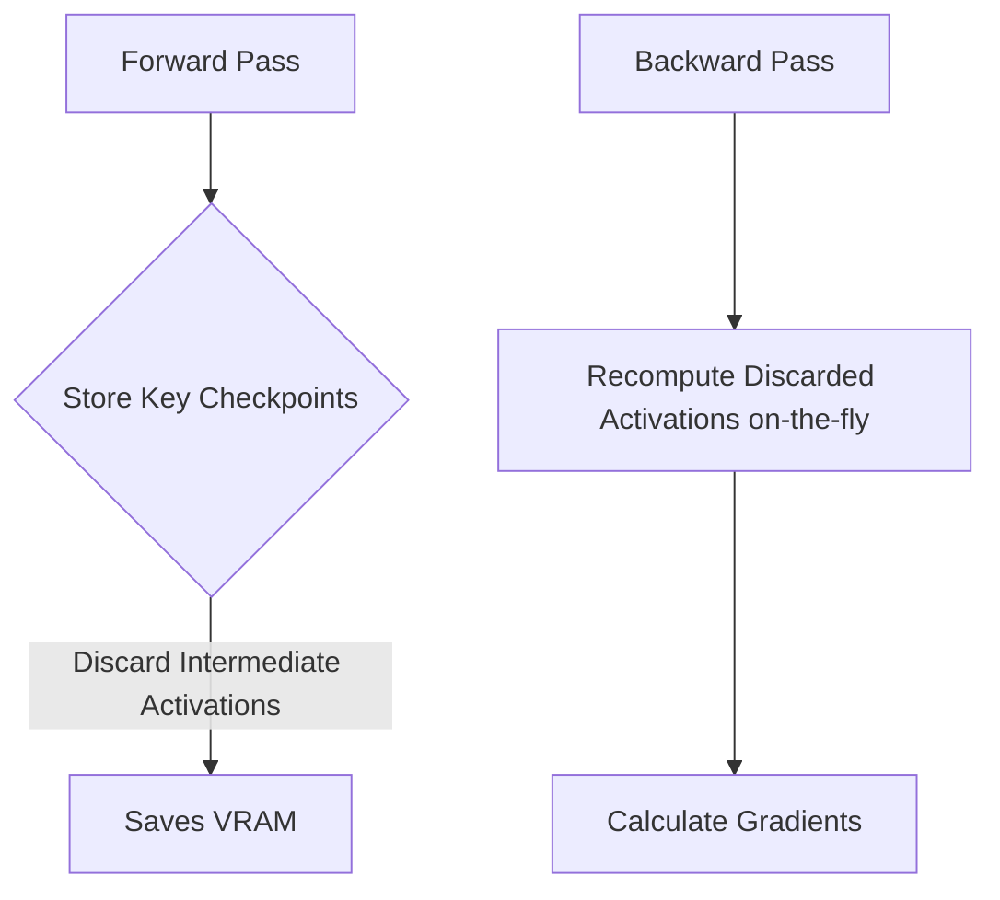

# Activation Memory Checkpointing

[⬅️ Back to Main README](../README.md)

## 📊 Overview & Concept
### Overview
Activation checkpointing reduces peak VRAM footprint during deep network training by storing only key activations and recomputing intermediate ones during backpropagation.

### Key Characteristics
* **O(sqrt(N)) Memory:** Reduces activation memory costs dramatically.
* **Compute/Memory Trade-off:** Trades extra forward passes for reduced memory constraints.
* **Larger Batch Sizes:** Enables training large models on consumer GPUs.

## 🧬 Architectural Workflow

---
*Created as part of the Semantic Segmentation Evolution database.*
[⬅️ Back to Main README](../README.md)
