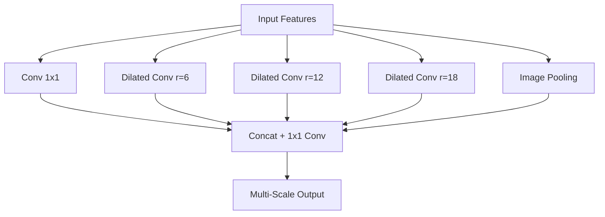

# Atrous Spatial Pyramid Pooling (ASPP)

[⬅️ Back to Main README](../README.md)

## 📊 Overview & Concept
### Overview
ASPP (introduced in DeepLabv2) uses multiple parallel dilated convolutions with different sampling rates to capture multi-scale context simultaneously.

### Key Characteristics
* **Multi-Scale Processing:** Processes images at diverse receptive fields.
* **Pyramid Structure:** Captures local details alongside global context.
* **Robust Representation:** Essential for objects appearing at variable scales.

## 🧬 Architectural Workflow

---
*Created as part of the Semantic Segmentation Evolution database.*
[⬅️ Back to Main README](../README.md)
