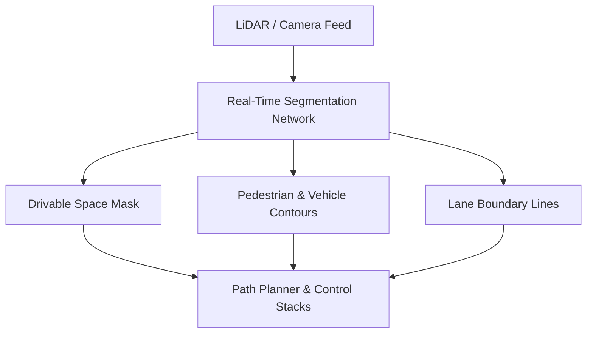

# Autonomous Vehicle Perception & Navigation Stacks

[⬅️ Back to Main README](../README.md)

## 📊 Overview & Concept
### Overview
Autonomous driving relies on real-time semantic and panoptic segmentation to map free drivable areas, identify lane lines, and detect obstacles for path planning and safety.

### Key Characteristics
* **Low Latency:** Must run at 30Hz or higher.
* **Multi-Modal:** Often fuses camera imagery with LiDAR/radar point clouds.
* **High Safety Integrity:** Zero tolerance for critical boundary misclassifications.

## 🧬 Architectural Workflow

---
*Created as part of the Semantic Segmentation Evolution database.*
[⬅️ Back to Main README](../README.md)
