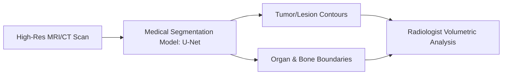

# High-Resolution Clinical Diagnostic Tissue Mapping

[⬅️ Back to Main README](../README.md)

## 📊 Overview & Concept
### Overview
In clinical settings, segmentation models (such as U-Net variants) identify organ borders, track tumor growth, and highlight regions of interest from medical imaging.

### Key Characteristics
* **Spatially Precise:** Exact pixel borders are critical for surgical paths.
* **Volumetric Integration:** Handles 3D voxel grids in MRI/CT scans.
* **Robustness:** Must tolerate variance in scanner calibrations and patient anatomy.

## 🧬 Architectural Workflow

---
*Created as part of the Semantic Segmentation Evolution database.*
[⬅️ Back to Main README](../README.md)
