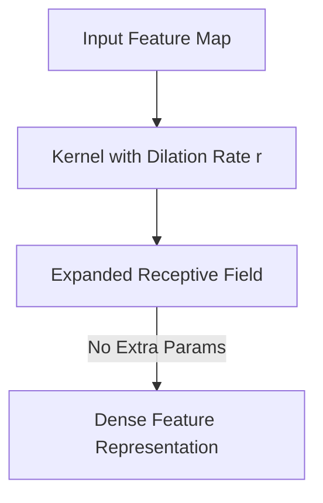

# Atrous / Dilated Convolutions

[⬅️ Back to Main README](../README.md)

## 📊 Overview & Concept
### Overview
Dilated (Atrous) convolutions insert spaces (holes) between kernel elements. This allows layers to capture a wider spatial context without downsampling or increasing parameter counts.

### Key Characteristics
* **Receptive Field Expansion:** Expands context view exponentially.
* **Resolution Preservation:** Avoids excessive pooling and downsampling.
* **Parameter Efficient:** Reuses standard convolution parameters with gaps.

## 🧬 Architectural Workflow

---
*Created as part of the Semantic Segmentation Evolution database.*
[⬅️ Back to Main README](../README.md)
