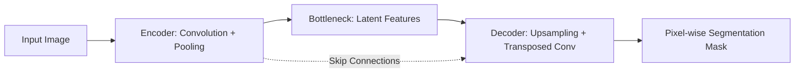

# Fully Convolutional & Encoder-Decoder Networks (FCN/U-Net)

[⬅️ Back to Main README](../README.md)

## 📊 Overview & Concept
### Overview
The introduction of FCNs (Long et al., 2015) revolutionized semantic segmentation by replacing fully connected layers with convolutional upsampling blocks. This allowed arbitrary-sized inputs and paved the way for modern encoder-decoder designs like U-Net and DeepLab.

### Key Characteristics
* **End-to-End Learning:** Direct mapping from raw pixels to pixel classification.
* **Skip Connections:** Routes low-level spatial features directly to the decoder.
* **Efficiency:** Eliminates redundant dense layer parameter overhead.

## 🧬 Architectural Workflow

---
*Created as part of the Semantic Segmentation Evolution database.*
[⬅️ Back to Main README](../README.md)
