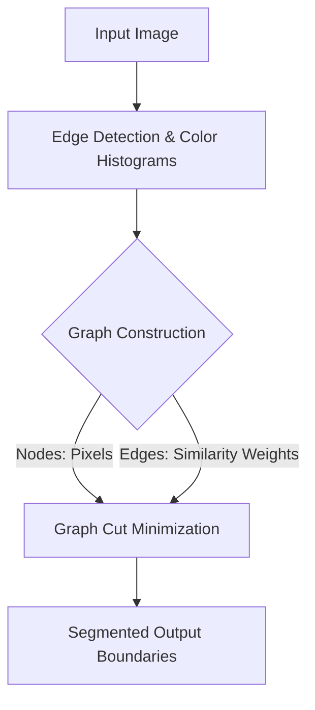

# Heuristic Boundary & Graph Cuts

[⬅️ Back to Main README](../README.md)

## 📊 Overview & Concept
### Overview
Early computer vision frameworks (pre-2015) relied on hand-crafted mathematical formulations. Watershed segmentation, Mean-Shift, and normalized graph cuts manually partitioned images into spatial zones based on visual gradients and color similarity.

### Key Characteristics
* **Local Gradients:** Relies heavily on edge detection and sudden histogram changes.
* **Lack of Context:** No deep semantic reasoning; segments strictly by contrast/edges.
* **Optimization:** Often formulated as energy minimization problems over a pixel-grid graph.

## 🧬 Architectural Workflow

---
*Created as part of the Semantic Segmentation Evolution database.*
[⬅️ Back to Main README](../README.md)
