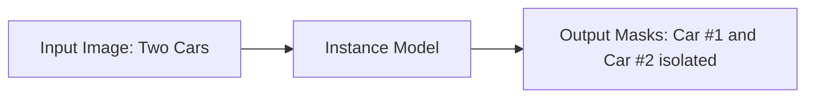

# Instance Segmentation

[⬅️ Back to Main README](../README.md)

## 📊 Overview & Concept
### Overview
Instance segmentation identifies, localizes, and segments individual objects of interest. Unlike standard semantic segmentation, it differentiates between distinct objects of the exact same category.

### Key Characteristics
* **Object Detection Integration:** Combines object localization (bounding boxes) with mask generation.
* **Unique Identifiers:** Distinguishes overlapping/adjacent instances.
* **Pioneering Work:** SDS (2014) and Mask R-CNN (2017).

## 🧬 Architectural Workflow

---
*Created as part of the Semantic Segmentation Evolution database.*
[⬅️ Back to Main README](../README.md)
