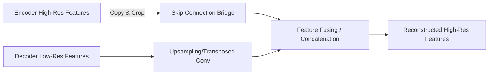

# Lateral Skip Connections

[⬅️ Back to Main README](../README.md)

## 📊 Overview & Concept
### Overview
Skip connections (popularized by U-Net) route fine-grained spatial information from early encoder layers directly to late decoder layers, bypassing the bottleneck to preserve edge details.

### Key Characteristics
* **Spatial Recovery:** Restores lost localization details.
* **Gradient Flow:** Helps gradients propagate backward during training.
* **Symmetrical Design:** Direct bridges between encoder and decoder resolution stages.

## 🧬 Architectural Workflow

---
*Created as part of the Semantic Segmentation Evolution database.*
[⬅️ Back to Main README](../README.md)
