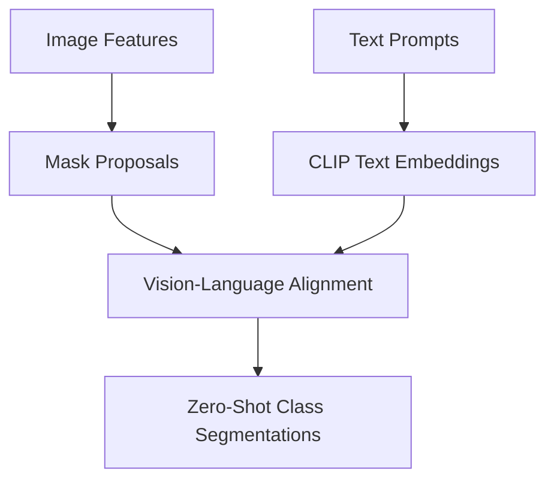

# Open-Vocabulary Segmentation (OVS)

[⬅️ Back to Main README](../README.md)

## 📊 Overview & Concept
### Overview
Open-vocabulary segmentation uses vision-language models (e.g., CLIP) to segment arbitrary classes defined by natural language prompts at inference time, removing constraints of fixed label sets.

### Key Characteristics
* **Language-Aligned:** Aligns pixel/mask embeddings with rich text representations.
* **Zero-Shot:** Segments classes unseen during training.
* **Interactive:** Flexibly query the image for any object query.

## 🧬 Architectural Workflow

---
*Created as part of the Semantic Segmentation Evolution database.*
[⬅️ Back to Main README](../README.md)
