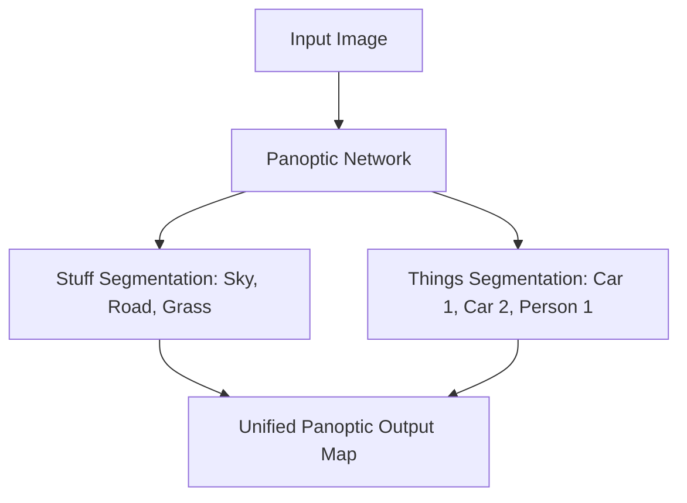

# Panoptic Segmentation

[⬅️ Back to Main README](../README.md)

## 📊 Overview & Concept
### Overview
Panoptic segmentation unifies semantic and instance segmentation. It maps continuous background classes ("Stuff" e.g., sky, road) and countable object instances ("Things" e.g., cars, pedestrians) in a single coherent representation.

### Key Characteristics
* **Unified Output:** Every pixel is assigned a class label and an instance ID (if applicable).
* **No Overlapping Masks:** Each pixel belongs to exactly one segment.
* **Holistic Scene Parsing:** Replaces fragmented task-specific pipelines.

## 🧬 Architectural Workflow

---
*Created as part of the Semantic Segmentation Evolution database.*
[⬅️ Back to Main README](../README.md)
