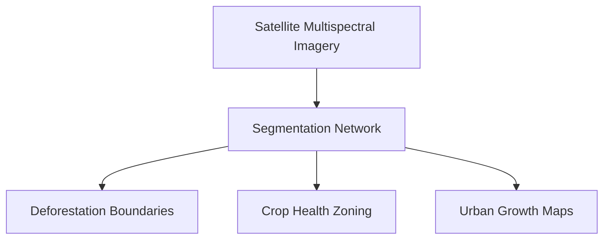

# Satellite Remote Sensing & Agricultural Zoning

[⬅️ Back to Main README](../README.md)

## 📊 Overview & Concept
### Overview
Earth observation and satellite imaging systems apply semantic segmentation to analyze forest cover, monitor agricultural health, track urban sprawl, and assist in disaster response.

### Key Characteristics
* **Hyperspectral Inputs:** Operates on channels beyond standard RGB (e.g., near-infrared).
* **Vast Scale:** Processes gigapixel-sized satellite maps.
* **Temporal Tracking:** Detects changes across multi-temporal historical feeds.

## 🧬 Architectural Workflow

---
*Created as part of the Semantic Segmentation Evolution database.*
[⬅️ Back to Main README](../README.md)
