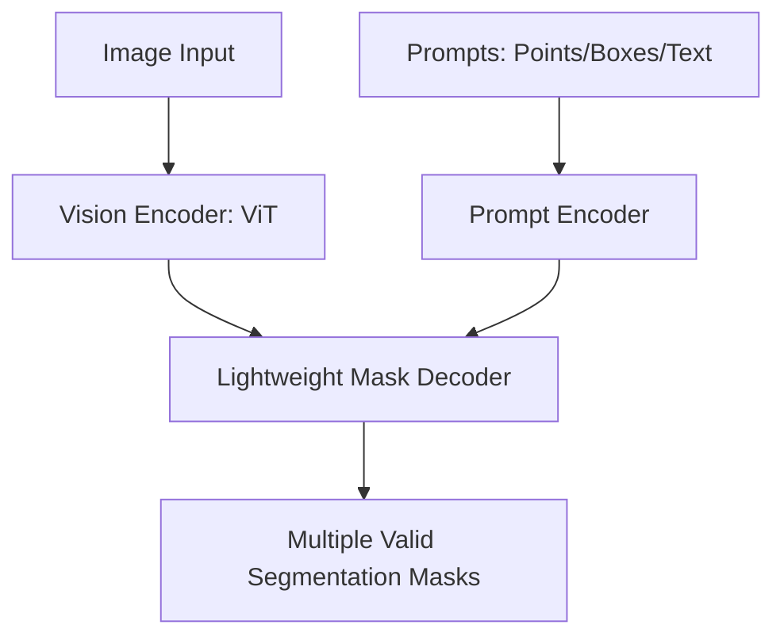

# Segment Anything Model (SAM) & Foundation Systems

[⬅️ Back to Main README](../README.md)

## 📊 Overview & Concept
### Overview
Meta's Segment Anything Model (SAM) established a promptable foundation model for image segmentation. Trained on 1.1 billion masks, it exhibits zero-shot generalization to novel objects and domains using interactive point, box, or text prompts.

### Key Characteristics
* **Promptability:** Interactive segmentation via geometric or textual cues.
* **Zero-Shot Transfer:** Generalizes immediately to unseen distributions.
* **Ambiguity Resolution:** Outputs multiple valid masks when prompts are ambiguous.

## 🧬 Architectural Workflow

---
*Created as part of the Semantic Segmentation Evolution database.*
[⬅️ Back to Main README](../README.md)
