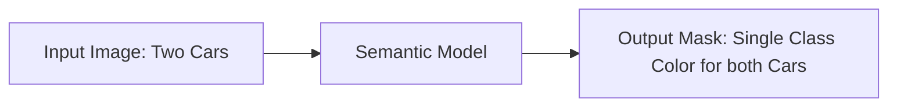

# Standard Semantic Segmentation

[⬅️ Back to Main README](../README.md)

## 📊 Overview & Concept
### Overview
Standard semantic segmentation treats every pixel as an independent classification target. It assigns a class label (e.g., car, person, sky) to each pixel without distinguishing between individual objects of the same category.

### Key Characteristics
* **Class-Level Masking:** Grouping all instances of a class into one collective region.
* **Dense Labeling:** Map is spatially aligned with input.
* **Simple Outputs:** Lacks tracking or counting capability for individual objects.

## 🧬 Architectural Workflow

---
*Created as part of the Semantic Segmentation Evolution database.*
[⬅️ Back to Main README](../README.md)
