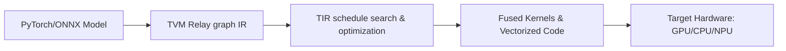

# TVM & Hardware Compiler Optimization

[⬅️ Back to Main README](../README.md)

## 📊 Overview & Concept
### Overview
TVM compiles high-level neural networks into optimized machine code, merging and optimizing operators (like convolution, activation, and normalization) directly into hardware registers.

### Key Characteristics
* **Operator Fusion:** Combines sequential operations to reduce memory transfers.
* **Automated Tuning:** Optimizes kernels for specific target chips.
* **Deployment efficiency:** Lowers inference latency and memory footprints.

## 🧬 Architectural Workflow

---
*Created as part of the Semantic Segmentation Evolution database.*
[⬅️ Back to Main README](../README.md)
